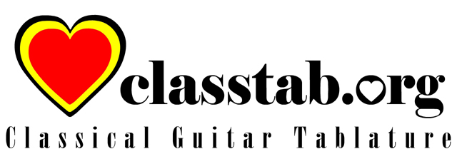

classtab
========

Classical Guitar Tablature
[HyperDrive](https://github/mafintosh/hyperdrive) Archive from classtab.org



## Installation

```sh
$ npm install @hyperdrives/classtab
```

or (Github):

```sh
$ npm install hyperdrives/classtab
```

## Usage

You can read the archive directly by simply requiring and initializing
the hyperdrive with the correct public key.

```js
const classtab = require('@hyperdrives/classtab')(key, opts)
classtab.readdir('/', console.log)
```

You can also leverage [random-access-http](
https://github.com/random-access-storage/random-access-http) to read the
archive from the public Github repository.

```js
'use strict'

const hyperdrive = require('hyperdrive')
const http = require('random-access-http')

const prefix = 'https://github.com/hyperdrives/classtab/raw/master/'
const key = '161fb2014dc31a0ba47af677307d6103843e2ad7139f7c8fcea19b1bbf35148f'
const drive = hyperdrive((filename) => http(prefix + filename), key)

classtab.readdir('/', console.log)
```

## Archive

The ClassTab archive represents a set of tablature and MIDI files for classical guitar.

### Public Key

```
161fb2014dc31a0ba47af677307d6103843e2ad7139f7c8fcea19b1bbf35148f
```

## Credits

See http://www.classtab.org/credits.htm

## License

GPLv3
